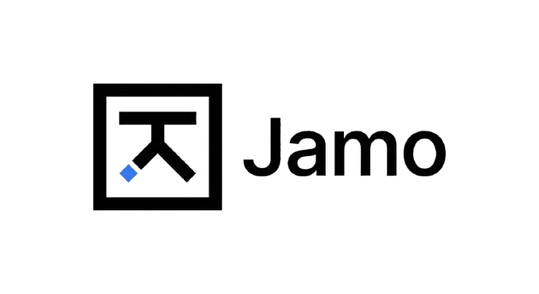

<p align="center">
  
</p>

<p align="center">
  A local-first desktop studio for building with canvas, code, and terminal — all version-controlled.
</p>

<p align="center">
  <a href="#install">Install</a> &middot;
  <a href="#features">Features</a> &middot;
  <a href="CONTRIBUTING.md">Contributing</a> &middot;
  <a href="SECURITY.md">Security</a>
</p>

---

## Install

### Quick install (macOS / Linux)

```bash
curl -fsSL https://raw.githubusercontent.com/jamohq/studio/main/scripts/install.sh | sh
```

### Download

Grab the latest release from [GitHub Releases](https://github.com/jamohq/studio/releases).

| Platform | Format |
|----------|--------|
| macOS (Apple Silicon) | `.dmg` / `.zip` |
| macOS (Intel) | `.dmg` / `.zip` |
| Linux (x64) | `.AppImage` / `.deb` |
| Linux (arm64) | `.AppImage` / `.deb` |

### From source

```bash
git clone https://github.com/jamohq/studio.git
cd studio
pnpm install
pnpm dev
```

## Features

- **Canvas** — Excalidraw-based visual editor
- **Code** — CodeMirror 6 with vim mode, syntax highlighting, and autosave
- **Terminal** — built-in terminal powered by a Go PTY backend
- **Version control** — Git-based sync, history, and revert at file, folder, and project levels
- **Rich text** — TipTap editor for notes and documentation
- **File management** — create, rename, delete, and organize files
- **Activity feed** — live panel showing workspace events
## Architecture

Jamo Studio runs as two processes:

- **Electron + React/TypeScript frontend** (`apps/desktop/`) — the desktop UI
- **Go gRPC engine** (`engine/`) — workspace operations, terminal sessions, and file management

The Electron main process spawns the Go engine and communicates over gRPC with bearer token auth.

```
apps/desktop/       Electron app (main + renderer)
engine/             Go gRPC backend
proto/jamo/v1/      Protocol buffer definitions
scripts/            Build and codegen scripts
```

## Contributing

See [CONTRIBUTING.md](CONTRIBUTING.md).

## Security

To report a vulnerability, see [SECURITY.md](SECURITY.md).

## License

Jamo Studio is licensed under the [GNU Affero General Public License v3.0](LICENSE).

Commercial licenses are available — contact [go.jhson@gmail.com](mailto:go.jhson@gmail.com) for details.
